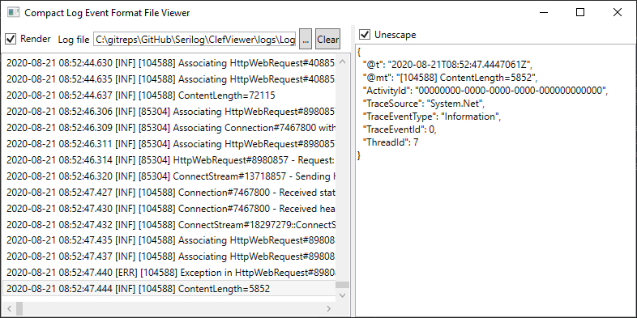

# CLEF Viewer 

A simple, light-weight and fast Compact Log Event Format file viewer.

CLEF is lines of JSON strings produced by [Serilog.Formatting.Compact](https://github.com/serilog/serilog-formatting-compact).

### Environment

- [.NET Core 3.1](https://dotnet.microsoft.com/download/dotnet-core/3.1)
- Windows 10 (1604) or later

### Usage

- Open log file by pressing [...] button or type file path in the [Log file] textbox. 
  - Log is loaded asynchronously. During loading is executed, you can press [Clear] or load another log file.
- Left pane shows log lines. They are rendered if [Render] is checked. If unchecked, raw log lines are displayed.
- Right pane displays a log line selected by left pane as indented. If [Unescape] is checked, unescape special characters like \r, \n.